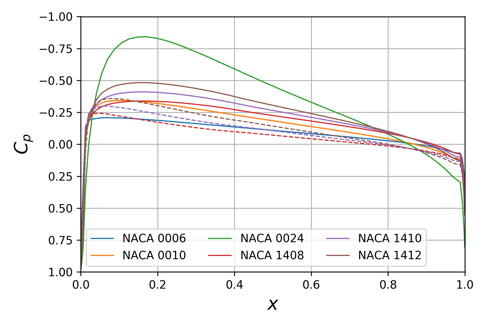
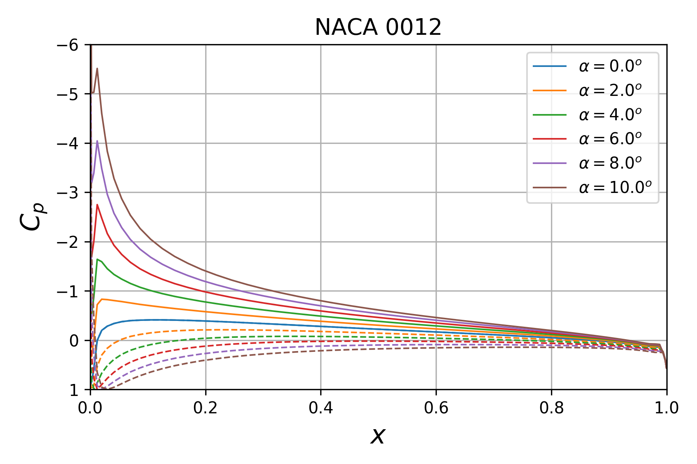

# `aeropython` example using `automan` framework

The present repository was created as part of the review of manuscript `CiSESI-2018-02-0013` for _Computing in Science and Engineering_.

It contains an toy example using the `automan` framework.
[`automan`](https://github.com/pypr/automan) is a Python-based framework to help researchers automate their computational workflows.
Here, we use a small in-house Python package, `aeropython`, to compare the surface pressure coefficients from multiple NACA airfoils at various angles of attack.
`aeropython` implements a simple two-dimensional panel method, using source and vortex sheets, to solve steady, inviscid, and irrotational flow.

Files of interest:
* `panelmethod.py`: script to solve the panel method, compute and write the surface pressure coefficient for an airfoil.
* `automan_example.py`: `automan` framework to compute a series of problems and to generate figures.
* `Dockerfile`: set of instructions used to build the Docker image `mesnardo/aeropython:0.1.1-lite`, publicly available on DockerHub.


The Docker image capturing the working environment was built and pushed to DockerHub:
```
docker build --tag aeropython:0.1.1-lite .
docker tag aeropython:0.1.1-lite mesnardo/aeropython:0.1.1-lite
docker push mesnardo/aeropython:0.1.1-lite
```


## Run the example

Pull the DockerHub image and run a container:
```
docker pull mesnardo/aeropython:0.1.1-lite
docker run -it --name automan_example mesnardo/aeropython:0.1.1-lite /bin/bash
```

Once inside the container, clone the present repository and change directory to it:
```
cd
git clone https://github.com/mesnardo/automan-example.git
cd automan-example
```

To run the simulations and create the figures using `automan`:
```
python automan_example.py
```

The simulation data are stored in the folder `data`.
The figures are in the folder `manuscript/figures`.

Here are the two figures generated by the present example:


> Figure 1: Surface pressure coefficient for different NACA airfoils
> immersed in a freestream with a zero-degree angle of incidence.
> (Solid line for the upper surface of the airfoil; dash line for the lower
> surface.)


> Figure 2: Surface pressure coefficient on the NACA0012 airfoil with different
> angles of incidence for the freestream flow. (Solid line for the upper
> surface; dash line for the lower surface.)

